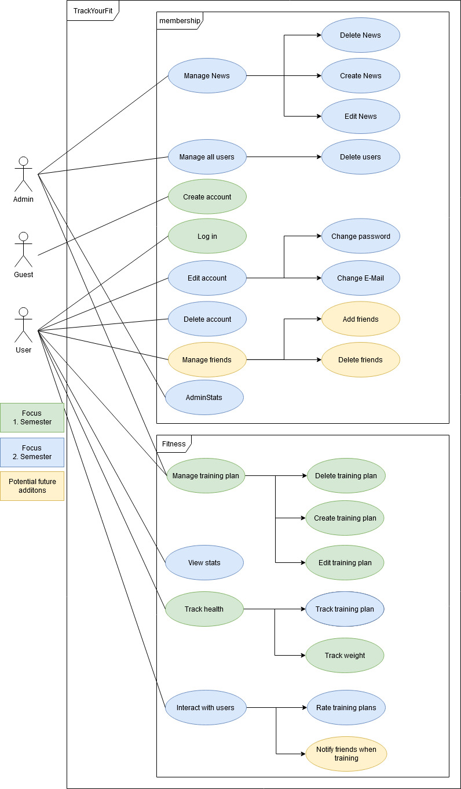

# TrackYourFit 
# Software Requirements Specification
# For Webapplication and Cross-platform-app

## Revision History

| **Date** | **Version** | **Description** | **Author** |
| --- | --- | --- | --- |
| 21.10.2019 | 1.0 | First Version | TrackYourFit-Team |

## Table of Contents
1. [Introduction](#introduction)
    1. [Purpose](#purpose)
    2. [Scope](#scope)
    3. [Definitions, Acronyms, and Abbreviations](#definitions-acronyms-and-abbreviations)
    4. [References](#references)
    5. [Overview](#overview)
2. [Overall Description](#overall-description)
3. [Specific Requirements](#specific-requirements)
    1. [Functionality](#functionality)
        1. [Web-Application](#web-application)
        2. [Cross-Platform-Mobile-Application](#cross-platform-mobile-application)
    2. [Usability](#usability)
        1. [Smartphone and PC user](#smartphone-and-pc-user)
    3. [Reliability](#reliability)
        1. [Server reliability](#server-reliability)
    4. [Performance](#performance)
        1. [Real-Time-Changes](#real-time-changes)
    5. [Supportability](#supportability)
        1. [Language Support](#language-support)
    6. [Design Constraints](#design-constraints)
        1. [MVC Architecture](#mvc-architecture)
    7. [On-line User Documentation and Help System Requirements](#on-line-user-documentation-and-help-system-requirements)
    8. [Purchased Components](#purchased-components)
    9. [Interfaces](#interfaces)
        1. [User Interfaces](#user-interfaces)
        2. [Hardware Interfaces](#hardware-interfaces)
        3. [Software Interfaces](#software-interfaces)
        4. [Communications Interfaces](#communications-interfaces)
    10. [Licensing Requirements](#licensing-requirements)
    11. [Legal, Copyright, and Other Notices](#legal-copyright-and-other-notices)
    12. [Applicable Standards](#applicable-standards)
4. [Supporting Information](#supporting-information)

# Software Requirements Specification

## Introduction
### Purpose

This SRS describes all specifications for "TrackYourFit". It's a Web-based application. "TrackYourFit" allows users to share their training plans with friends and other users online. In this document the usage of the "TrackYourFit"-Website. Furthermore reliability, reaction speed and other important characteristics of this project will be specified. This includes design and architectural decisions regarding optimization of these criteria as well.

### Scope

This software specification applies to the whole "TrackYourFit" application. The website allows users to share training plans, get feedback from other users and have a look into youre complete training process. It is a crowd source training platform with intresting up to date news and intresting traingdata to look at.

### Definitions, Acronyms, and Abbreviations

In this section definitions and explanations of acronyms and abbreviations are listed to help the reader to understand these.

| Abbreviation | Explanation |
| --- | --- |
| UC | Use Case |
| Web-App | Is a Application hosted on a Webserver |
| DB | Database which stores the data |

### References

| Title | Date |
| --- | --- |
| Link to the [Blog](https://trackyourfit.wordpress.com/) |   |
| Link to [Github](https://github.com/tobi4321/TrackYourFit) |   |
| Link to [UCD](https://github.com/Bronzila/TrackYourFit_docs/blob/master/Projectmanagement/UseCaseDiagram.jpg) |   |
| Link to [Use Case Crud TrainingPlan](https://github.com/Bronzila/TrackYourFit_docs/blob/master/Projectmanagement/UC-CRUD-TrainingPlan/UC-CRUD-Trainingplan.md) |   |
| Link to [Use Case TrackHealth](https://github.com/Bronzila/TrackYourFit_docs/blob/master/Projectmanagement/UC-TrackWeight/UC-TrackWeight.md) |   |

### Overview

The following chapters are about our vision and perspective, the software requirements, the demands we have, licensing and the technical realization of this project.

## Overall Description

Our project is supposed to help sport enthusiasts and those who want to get sporty and active.

So you will be able to:

- create, execute and track training plans
- get plans from other Trackers
- rate other training plans and give feedback to improve them
- track your weight to see your Improvments

The following diagram shows the use cases declared for this project.

 

## Specific Requirements
### Functionality
#### Web-Application
- Manage News

Admin should be able to delete, edit and create news, that the normal user then gets presented on the home page

- Manage all users

Admin should be able to delete inappropriate users and give/take usergroups like admin and trainer

- Create account

Guest should be able to register.

- Log in
Users should be able to log in after registration.
- Edit account
User should be able to change their user information.
- Delete account
User should be able to delete their account with all user data.
- Manage friends
User should be able to add and delete friends.
- Manage training plan
User should be able to create, delete and edit their training plans.
- View stats
User can view their own training progress.
- Track weight
User can track his progress and other health-related data (e.g. weight).
- Interact with users
User can rate other training plans and notify friends when working out.

### Usability
#### Smartphone and PC user

User should know how to use a smartphone or computer to access the Website.

### Reliability
#### Server reliability

Availability is set to 95%, since the server should only be unreachable if major changes are going to be published.
MTTR as soon as possible, depending on the failure reason.

### Performance
#### Real-Time-Changes

Since there are no real time reliable functions in the application, performance is only limited by the access to the server.

### Supportability
#### Language Support

We will use the following languages, which will also be well supported in the future:

- C#
- SQL
- java-script

### Design Constraints
#### MVC Architecture

The Webapplication interacts through a REST-Interface with the back-end to transfer the data from back-end to the webpage. The entity framework core provides the access from back-end to the database.

### On-line User Documentation and Help System Requirements

The whole application will be built with an intuitive design.

### Purchased Components

Ionos webservice Hosting

### Interfaces
#### User Interfaces

Users can register and log in. Edit their profiles and manage their training plans including monitor the training process.

#### Hardware Interfaces

The web application is provided for Linux and Windows Server. It could be managed on Docker but it is published via ftp. It supports all popular browsers.

#### Software Interfaces

The database is included into the Webserver. The SQL database can be managed with SQL Server Management Studio.

#### Communications Interfaces

An internet connection is required for the web-apps.

### Legal, Copyright, and Other Notices

We do not ensure that there is successful training process. We also do not ensure that any of the training plans are correct. Using any of the training plans is at your own risk. We are not responsible for any injuries caused by training with the training plans on our platform.

