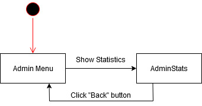

# TrackYourFit
## Use-Case Specification: AdminStats | Version 1.0

## 1. Use-Case: AdminStats

### 1.1 Brief Description

This Use-Case is pointing out, how the admin can get some overall informations about the users and generated data by users.

## 2. Flow of Events

### 2.1 Basic flow

A System Admin needs information about the use of the software. If a specific uc is not used enough the developer can check why it happens and start changing these issues. In the Admin Menu there is a button to visit the StatView. On that view there are amounts of all users and amount of trainingplans created by users. A Chart is displaying the tracked trainings per day since one year ago.

## 3. Special Requirements

### 3.1 Owning An Account
        
In order access the stats the admin has to have an admin account. Only if he has one, the view of stats will be visible.

## 4. Preconditions

### 4.1 The user has to be logged in

To ensure proper privacy of news items the admin and have to be logged in when viewing stats.

## 5. Postconditions

### 5.1 Back

After looking for the stats the admin can go back to the admin menu with a single click on the back button.

## 6. Extentsion Points

tbd
