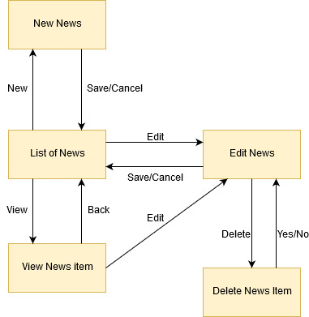
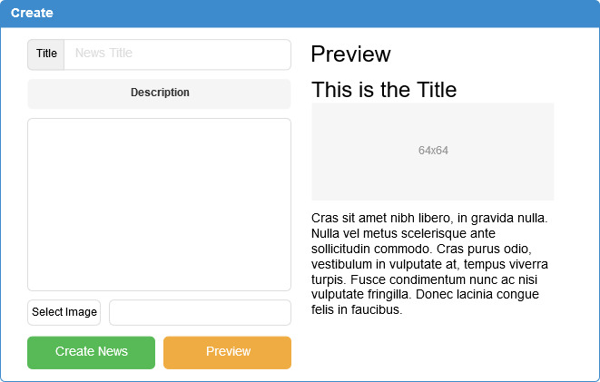
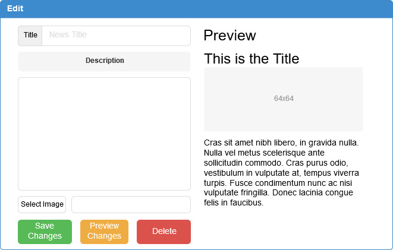
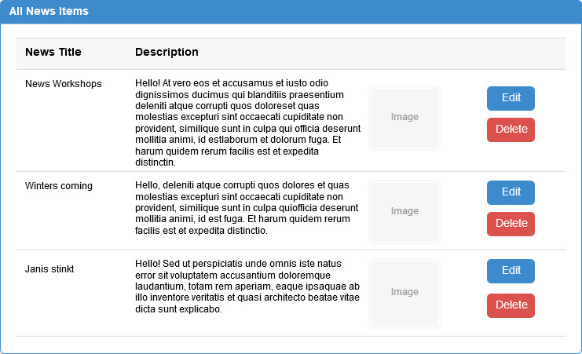
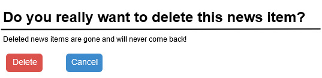

# TrackYourFit
## Use-Case Specification: CRUD News | Version 1.0

## 1. Use-Case: CRUD News

### 1.1 Brief Description

This Use-Case is pointing out, how the admin will be able to use CRUD-actions on news to organize them.

## 2. Flow of Events

### 2.1 Basic flow

A admin will list all news and may create a new one. From time to time the admin probably wants to add new news items, edit old ones or even delete them. The created news items will be displayed for the users.

### 2.2 Creation  

The creation of a new News item. The admin will be asked to enter a title, a Text and an image. The admin will also be able to select one from templates. After entering a title for a new news item, the admin is presented with a view similar to the edit page.

### 2.3 Edit

During editing the admin can modify the content of the news item.

### 2.3 List

The admin wants to be able to view all news items. Therefore he is presented a list with all entries.

### 2.4 Delete

Maybe the admin wants to delete a news item, if he doesn't use them anymore. Therefore there will be an extra "delete" button on the edit-page.

## 3. Special Requirements

### 3.1 Owning An Account
        
In order to create a new news item the admin has to have an admin account. Only if he has one, the dialog of a creation of a news item will be visible.

## 4. Preconditions

### 4.1 The user has to be logged in

To ensure proper privacy of news items the admin and other users have to be logged in when working with/viewing news.

## 5. Postconditions

### 5.1 Create

After creating a new news item the admin will be redirected to the overview of all news items, where the new entry will already be displayed.

### 5.2 Edit

After the admin saved his edits, the updated data will be displayed in the news item overview.

### 5.3 Delete

After confirming the deletion modal, the news item will be permanently removed and no longer displayed in the list overview.

## 6. Extentsion Points

tbd
