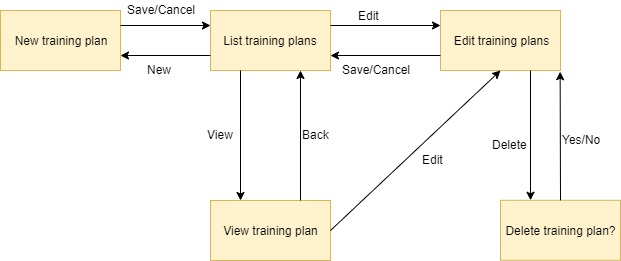
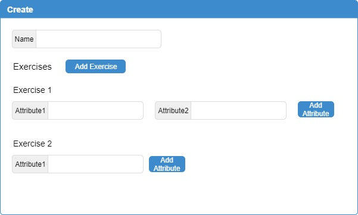
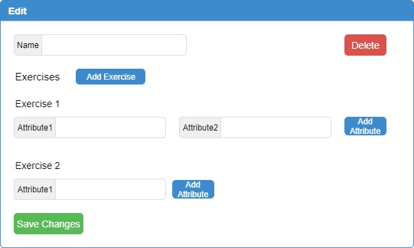
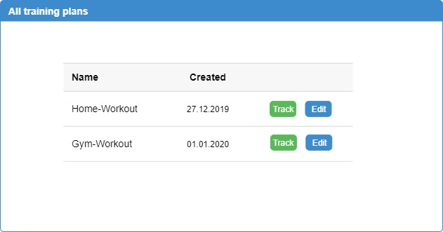
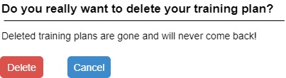

# TrackYourFit
## Use-Case Specification: CRUD Trainingplan | Version 1.0

## 1. Use-Case: CRUD Trainingplan

### 1.1 Brief Description

This Use-Case is pointing out, how the user will be able to use CRUD-actions on training plans to organize them.

## 2. Flow of Events



### 2.1 Basic flow

A user will list all training plans and may create a new one. From time to time the user probably wants to add new training plans, edit old ones or even delete them.

### 2.2 Creation  

The creation of a new Training plan. The user will be asked to enter a name and multiple exercises these have different attributes depending on what the user wants to do (e.g. a run doesn't have the same attributes as a gym-workout). The user will also be able to select one from templates. After entering a name for a new trainingplan, the user is presented with a view similar to the edit page.



```gherkin
Feature: Create trainingplan
   as a user
   I want to Create and name a trainingplan.

   Scenario: Valid trainingplan name
      Given I am logged in
      And I have navigated to section "Overview" 
      When I enter a text into input field with id "TPname"
      And I press the button with id "TPaddBTN"
      Then Section "Edit" should open

   Scenario: No trainingplan name
      Given I am logged in
      And I have navigated to section "Overview" 
      And I enter no text into input field with id "TPname"
      When I press the button with id "TPaddBTN"
      Then Alert with text "Please input a valid name" should be displayed
```

### 2.3 Edit

During editing the user can modify the content of the training plan.



```gherkin
Feature: Update Trainingplan
   as a user
   I want to update my Trainingplan

   Scenario: Rename Trainingplan
      Given I am logged in
      And I have navigated to section "Edit" on an trainingplan
      When I change the name in the field with id "name"
      And I press the Button named "Save"
      Then The confirmation popup should be displayed.

   Scenario: Accept rename
      Given I am logged in
      And I have navigated to section "Edit" on an trainingplan
      And the confirmation popup is displayed
      When I press the Button named "Confirm"
      Then The popup should close
      And the name should have changed

   Scenario: Abort rename
      Given I am logged in
      And I have navigated to section "Edit" on an trainingplan
      And the confirmation popup is displayed
      When I press the Button named "Cancel"
      Then The popup should close
      And the name should not have changed
```

### 2.3 List

The user wants to be able to view all of his training plans. Therefore he is presented a list with all entries.



```gherkin
Feature: List all Trainingplans
   as a User
   I want to list all my Trainingplans and be asked to create one if I don't have any
   
   Scenario: User has Trainingplans
   Given I am logged in
   Given I am on the Page Index
   When I press the button with the id "overviewTP"
   Then Section "Overview" should open
   And the table with the id "allTrainingplans" should have more than one row.

   Scenario: User does not have any Trainingplans
   Given I am logged in
   Given I am on the Page Index
   When I press the button with the id "overviewTP"
   Then Section "Overview" should open
   And I am prompted to create a Trainingplan.

```

### 2.4 Delete

Maybe the user wants to delete a training plan, if he doesn't use them anymore. Therefore there will be an extra "delete" button on the edit-page.



```gherkin
Feature: Delete Trainingplan
   as a user
   I want to delete my trainingplan.
   
Scenario: User accepts to delete the trainingplan
   Given I am logged in
   Given I have navigated to the section "Edit"
   Given I have pressed the button with id "askDeleteTP"
   When I press the button with the id "deleteTP"
   Then section "Overview" should open.

Scenario: User declines to delete the trainingplan
   Given I am logged in
   Given I have navigated to the section "Edit"
   Given I have pressed the button with id "askDeleteTP"
   When I press the button with the id "cancelDeleteTP"
   Then section "Edit" should open.
```

## 3. Special Requirements

### 3.1 Owning An Account
        
In order to create a new training plan the user has to have an account. Only if he has one, the dialog of a creation of a training plan will be visible.

## 4. Preconditions

### 4.1 The user has to be logged in

To ensure proper privacy of training plans and personal data the user has to be logged in when working with training plans.

## 5. Postconditions

### 5.1 Create

After creating a new training plan the user will be redirected to the overview of all his training plans, where the new entry will already be displayed.

### 5.2 Edit

After the user saved his edits, the updated data will be displayed in the training plans overview.

### 5.3 Delete

After confirming the deletion modal, the training plan will be permanently removed and no longer displayed in the list overview.

## 6. Extentsion Points

## 7. Function Points

33.8
