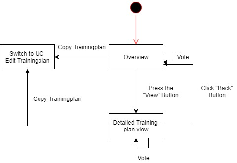
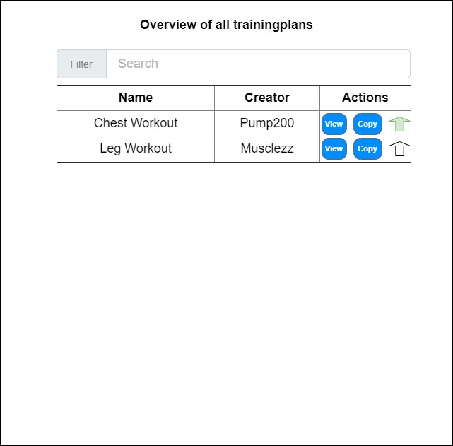
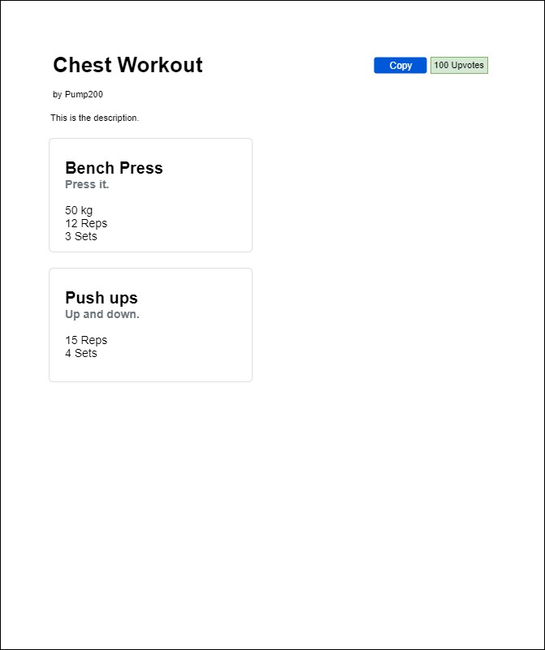

# Use-Case Specification: Track Trainingplan

## Track Trainingplan
### Brief Description

As a user of the application you want to view trainingplans by other users, to copy them and use them depending on how good they are.

## Flow of Events
### Basic Flow

## Alternative Flows
###  First Alternative Flow
(tdb)

#### An Alternative Subflow
(tdb)

### Second Alternative Flow
(tdb)

## Special Requirements
### Owning an Account

The user needs an account to be able to use the feature.

## Preconditions
### The user needs to be logged in

To be able to know which user is submitting data, the user is required to be logged in.

## Postconditions

### Successfully copied the trainingplan

The user should have a trainingplan equal to the one displayed on the overview

### Vote counter

If the user has voted/unvoted a trainingplan, it should be visibile in the overview

## Extension Points

(tbd)

## Name of Extension Point

(tdb)
