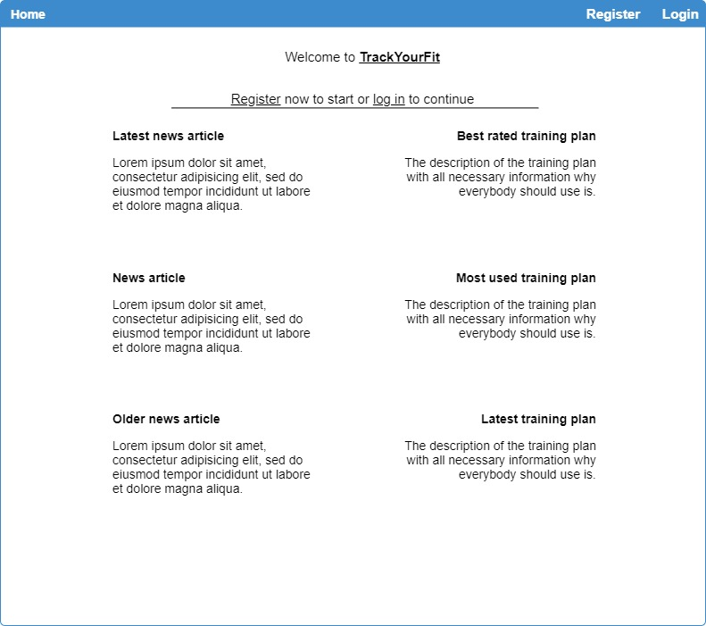
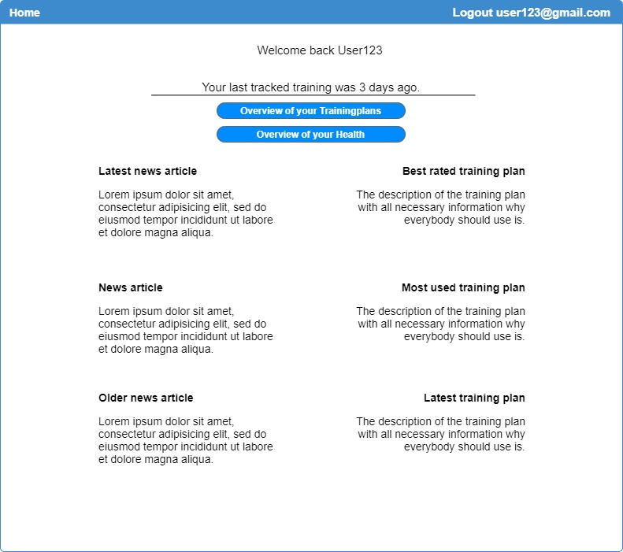

# Use-Case Specification: Show Extended Homeview

## User Management
### Brief Description

On the homepage should be displayed the latest news and suggested trainingplans.

## Flow of Events
### Basic Flow


``` Gherkin
Feature: see more details
   as an user (logged in or not) I want to see more details about the news or trainingplans

   Scenario: view news details
      Given I have navigated to "Home"
      When I click on the displayed news
      Then The complete news is opened in a new page

   Scenario: view trainingplan details
      Given I have navigated to "Home"
      When I click on a displayed traininplan
      Then The detailed trainng plan is opened in a new page
      
Feature: Login 
   as an not signed in user I want to log in or create an account

   Scenario: Login
      Given I have navigated to "Home"
      And I am not logged in
      When I click on the button login
      Or I click on the linked text log in
      Then I am redirected to /account/login
      
   Scenario: Register
      Given I have navigated to "Home"
      And I am not logged in
      When I click on the button register
      Or I click on the linked text register
      Then I am redirected to /account/register
      
Feature: Continue to Overview 
   as an logged in user I want to see my trainingplans and my health.

   Scenario: TrainingplanOverview
      Given I have navigated to "Home"
      And I am logged in
      When I click on the button Overview of your trainingplans
      Then I am redirected to /Overview

   Scenario: HealthOverview
      Given I have navigated to "Home"
      And I am logged in
      When I click on the button  Overview of your health
      Then I am redirected to /Track/OverviewWeight
```


## Alternative Flows
###  First Alternative Flow
(tbd)

#### An Alternative Subflow
(tbd)

### Second Alternative Flow
(tbd)

## Special Requirements

## Preconditions
(tbd)

## Postconditions
(tbd)

## Extension Points

(tbd)

## Name of Extension Point

(tdb)
## Function Points

Inputs:
- 2
Outputs
- 6
Inquiries:
- 1


FTR:
- 2
RET:
- 4
DETs:
- 9

-----
32 FP in total