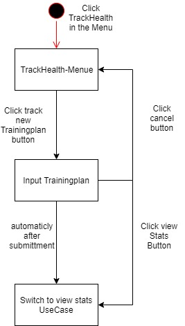
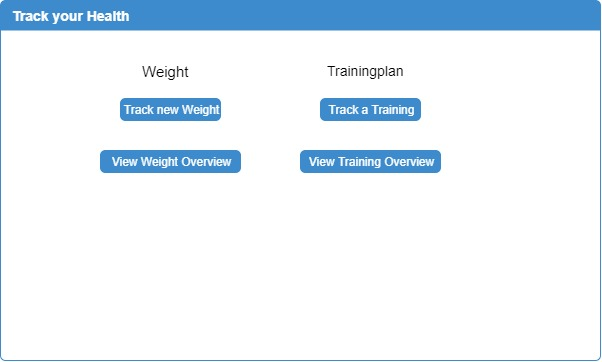
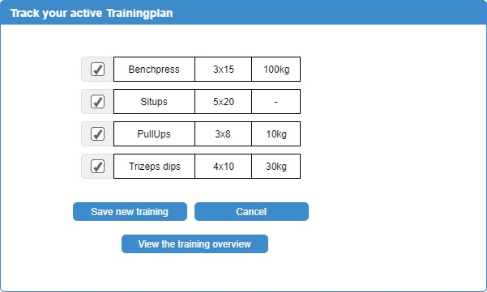

# Use-Case Specification: Track Trainingplan

## Track Trainingplan
### Brief Description

To track your progress in training is a key feature of a training app. In this feature the user will be able to insert his Training data to be able to see the progress of his or her training, by monitoring there progressing of the activated training plan.

## Flow of Events
### Basic Flow




``` Gherkin
Feature: trackTrainingsplan

   This Feature enables the user to submitt trainingsprogress on a by the user chosen Trainingplan.


   Scenario: GoToSubmittTrainingprogress

   Given I am logged in
   When I press the Menue Button having the name "Track Health"
   And I press the Button having the name "Trainingprogress"
   Then Section "Submitt Trainingprogress" should open


   Scenario: SubmittTrainingplanFully

   Given Section "Submitt Trainingprogress" is open
   When I check all the checkboxes
   And I press the Button Submitt
   Then Then I should see alert text as "You Successfully submitted your weight"
   And Section "Mainwindow" should open


   Scenario: SubmittTrainingplanPartially

   Given Section "Submitt Trainingprogress" is open
   When I check a potion of the checkboxes
   And I press the Button having name "Submitt"
   Then Then I should see alert text as "Is it correct that you haven`t done These Workots:"
   And Window having name "Summory of unchecked Workouts" should be present

   Scenario: CorrectIHaventDoneTheWorkout

   Given Window having name "Summory of unchecked Workouts" is open
   When i press the Button having name "Correct"
   Then Then I should see alert text as "You Successfully submitted your weight"
   And Section "Mainwindow" should open

   Scenario: InCorrectIHaventDoneTheWorkout

   Given Window having name "Summory of unchecked Workouts" is open
   When i press the Button having name "Incorrect"
   Then Window having name "Summory of unchecked Workouts" should close
```

## Alternative Flows
###  First Alternative Flow
(tdb)

#### An Alternative Subflow
(tdb)

### Second Alternative Flow
(tdb)

## Special Requirements
### Owning an Account

The user needs an account to be able to use the feature

### Has an active trainingplan

For the trainingplan tracking the user needs an active trainingplan on his account.

## Preconditions
### The user needs to be logged in

To be able to know which user is submitting data, the user is required to be logged in.

## Postconditions
### Switch to view stats use case

After the data is submitted the user will be automatically redirected to the view stats overview.

## Extension Points

(tbd)

## Name of Extension Point

(tdb)
