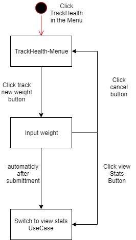
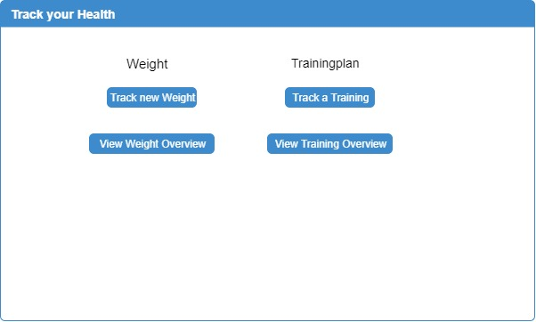
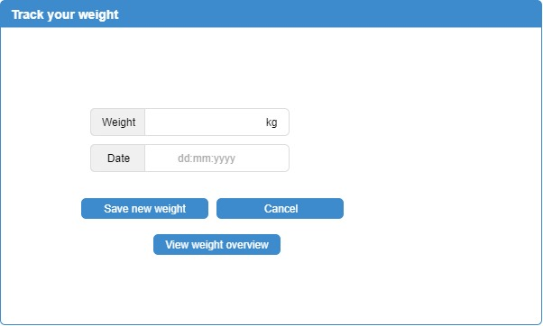

# Use-Case Specification: Track Weight

## Track Weight
### Brief Description

To track the progress of the overall health while training is very important. In this feature the user will be able to insert his health data to be able to see the progress by monitoring there weigh progression and BMI.

## Flow of Events
### Basic Flow



``` Gherkin
Feature: Submit Weight
   as a user
   I want to submit my weight

   Scenario: Accept weight
      Given I am logged in
      And I have navigated to section "TrackHealth" on an trainingplan
      And I have navigated to section "weight"
      When I change the weight in the field with id "weight"
      And I press the Button named "Submit"
      Then The View stats page is displayed

   Scenario: Reject weight
      Given I am logged in
      And I have navigated to section "TrackHealth" on an trainingplan
      And I have navigated to section "weight"
      When I press the Button named "Submit"
      Then Alert with text "Please input a valid weight" should be displayed
```


## Alternative Flows
###  First Alternative Flow
(tdb)

#### An Alternative Subflow
(tdb)

### Second Alternative Flow
(tdb)

## Special Requirements
### Owning an Account

The user needs an account to be able to use the feature

### Know the weight

To use the weight tracking feature the user only needs to know his or her weight.

## Preconditions
### The user needs to be logged in

To be able to know which user is submitting data, the user is required to be logged in.

## Postconditions
### Switch to view stats use case

After the data is submitted the user will be automatically redirected to the view stats overview.

## Extension Points

(tbd)

## Name of Extension Point

(tdb)

## Function Points
11