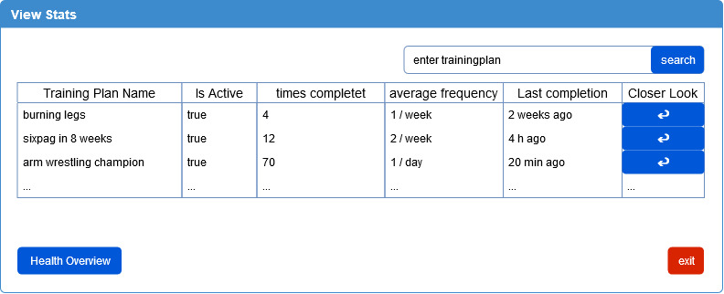
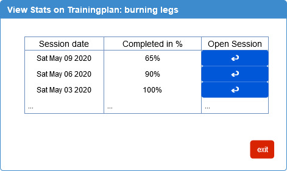

# Use-Case Specification: View Stats

## User Management
### Brief Description

Users are able to view there Stats on there activated or concluded trainingplans

## Flow of Events
### Basic Flow


``` Gherkin
Feature: see Stats
   I want to see stats of of one TP-Session

   Scenario: delete an Account
      Given I am logged in
      And I have navigated to section "View Stats"
      When I searched for the trainingplan of the session
      And I click on the "Enter"-Button in the list
      Then the View Stats of the TP dialog opens
      
   Scenario: reenter Session
     Given I am in the View Stats of the TP dialog
     When I click on the "Enter"-Button of the Session
     Then the Session is reopened
```


## Alternative Flows
###  First Alternative Flow
(tbd)

#### An Alternative Subflow
(tbd)

### Second Alternative Flow
(tbd)

## Special Requirements
### None

## Preconditions
(tbd)

## Postconditions
(tbd)

## Extension Points

(tbd)

## Name of Extension Point

(tdb)
