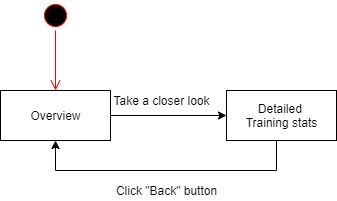

# Use-Case Specification: View Stats

## User Management
### Brief Description

Users are able to view there Stats on there activated or concluded trainingplans

## Flow of Events

### Basic Flow


``` Gherkin
Feature: see Stats
   I want to see stats of of one TP-Session

   Scenario: delete an Account
      Given I am logged in
      And I have navigated to section "View Stats"
      When I searched for the trainingplan of the session
      And I click on the "Enter"-Button in the list
      Then the View Stats of the TP dialog opens
      
   Scenario: reenter Session
     Given I am in the View Stats of the TP dialog
     When I click on the "Enter"-Button of the Session
     Then the Session is reopened
```


## Alternative Flows
None

## Special Requirements
### Owning an account
In order to look at your stats you need to have an account.
### None

## Preconditions
### The user has to be logged in
If the user isn't logged in he can't look at his trainings.
### The user has to have trained before
If the user hasn't trained before there wont be a proper statistic to look at.

## Postconditions

## Extension Points


## Name of Extension Point

## Function Points

User Inputs: 1

User Outputs: 9

User Inquiries: 3

DETs: 18

RETs: 4

FTR: 1

ILF: 1

EIF: 0

----

36.4 FP total
