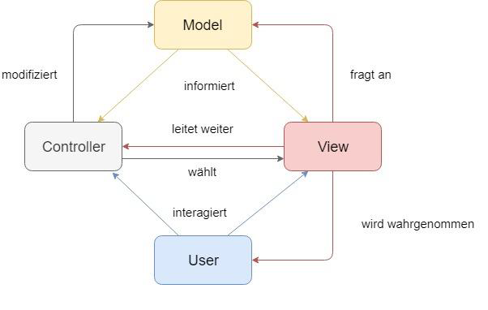
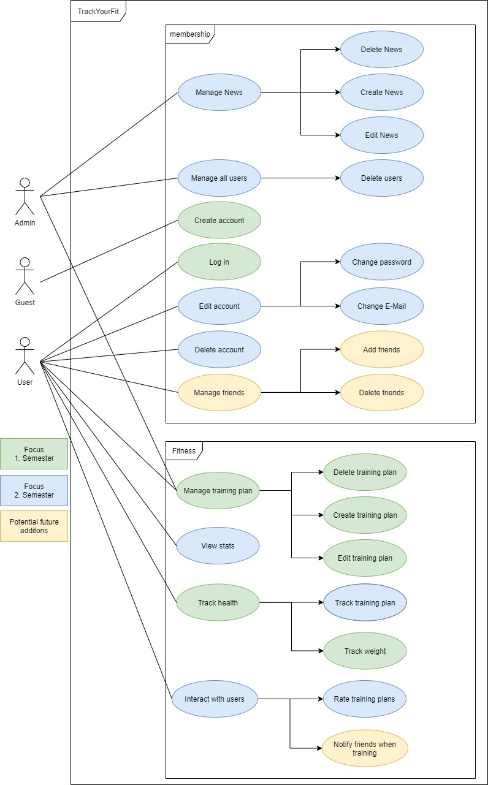
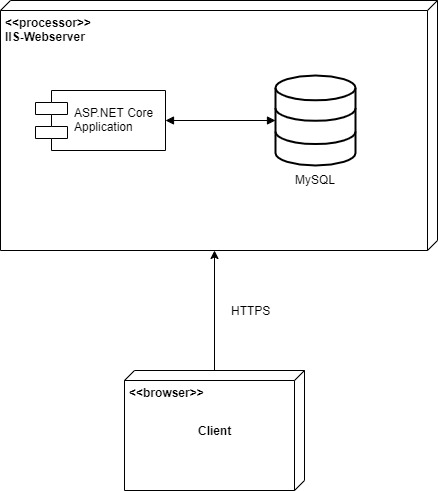

# Software Architecture Document

## 1. Introduction 
### 1.1 Purpose
This document provides a comprehensive architectural overview of the system, 
using a number of different architectural views to depict different aspects of the system. 
It is intended to capture and convey the significant architectural decisions which have been made on the system.

### 1.2 Scope
The scope of this SAD is to show the architecture of the TrackYourFit project. Affected are the class structure and the data representation.

### 1.3 References
- [GitHub](https://github.com/tobi4321/TrackYourFit)
- [Blog](https://trackyourfit.wordpress.com/)
- [Software Requirements Specification](https://github.com/tobi4321/TrackYourFit/blob/master/Projectmanagement/SRS.md)

## 2. Architectural Representation
TrackYourFit uses the MVC-Pattern for its architecture design.
Sadly, ASP.NET Core doesn't provide a good looking overview, so we stuck with a self created. As shown here (don't mind the german):  

## 3. Architectural Goals and Constraints 
We decided to use ASP.NET Core for the webapplication.

## 4. Use-Case View 

## 5. Logical View
### 5.1 Overview
Sadly in Visual Studio you can't really get a nice UML-Class-Diagram auto generated, so this is the Codemap.
To tidy it up a bit there are the controllers:

And our Models, which mostly represent our database as you can see in chapter 9:

### 5.2 Architecturally Significant Design Packages
We decided to use a few controllers, seperated by the purpose they have. Models are mostly used for accessing data, that's stored in the database or for communication reasons.
We also modualrized AJAX-Calls as one design pattern and added Dependency Injection to our controllers for the backend:\
\
As a short description: When using dependency injection, clients (= the class using an object) wont create the objects they need on their own, the objects (= services) will be injected by an (guess what) injector. One advantage is of this method is, that the client is much more flexible and configurable. Only the behaviour of the client is fixed, but it can act on anything that supports the interface it expects. Another upside is, that unit testing these clients is much easier, since you can mock the services, that are going to get injected into the client.
## 6. Process View

## 7. Deployment View

## 8. Implementation View

## 9. Data View
We're using a MSSQL database to store our data. 
MSSQL provides us with the functionality to create a database diagram so here it is:

## 10. Size and Performance

## 11. Quality
